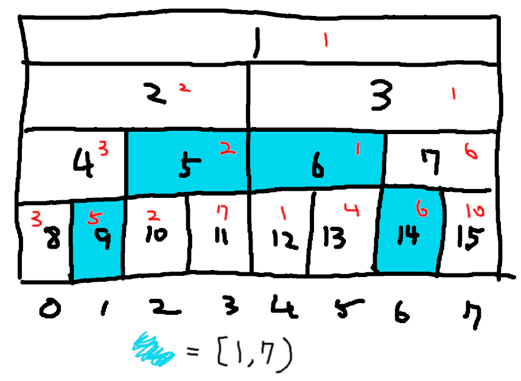
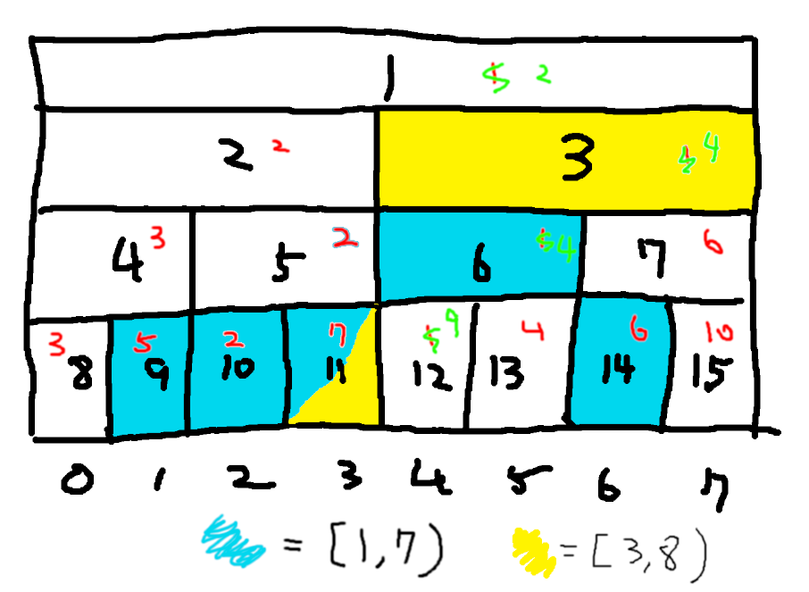

# 大綱

## 線段樹

- RMQ
- Lazy Tag
- ~~進擊的線段樹~~

# RMQ

## Problem

對 A[N] 進行以下操作

- 詢問 A[L..R] 最小值

$N\leq100000$

## Solution

經典的題目有很多解法:

- 分塊
- sparse table
- **線段樹**

## Problem

對 A[N] 進行以下操作

- 詢問 A[L..R] 最小值
- 修改 A[i] 值

## 把區間切斷

## 存上資料

## 修改

## 學會啦

Coding Time

## 可解範圍

你可以做任何 $A[l..r) = fun(A[l..m), A[m..r))$ 的題目

- 單點修改 區間最小值
- 單點修改 區間總和
- 單點修改 區間積
- 單點修改 區間最大公因數
- 單點修改 區間最大連續和

## 區間修改呢

區間加值單點求值?

- ~~差分轉換題目~~
- 交換詢問和操作

# Lazy Tag

## Problem

區間操作 區間詢問

## 圖形化

## Push

## 又學會啦

Coding Time
