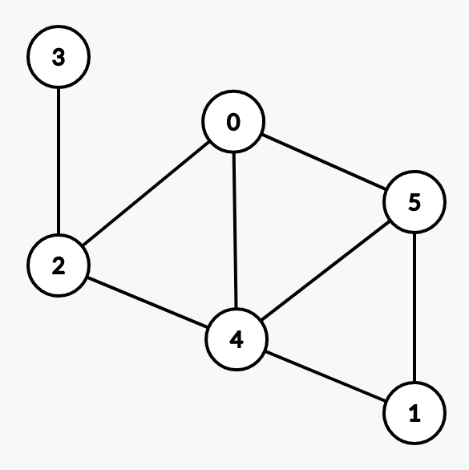
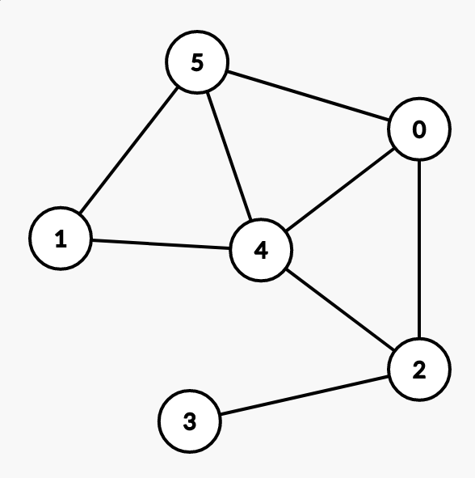
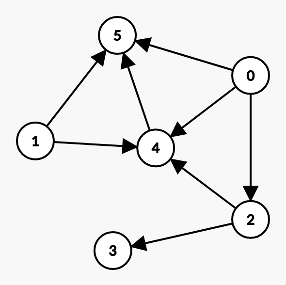

# Intro

## 大綱

- 圖的介紹
- 存圖
  - matrix
  - list
  - 前向星 (我不知道英文)
- 圖搜尋
- 連通性
- 二分圖
- Tree

## 什麼是圖

~~JPG, PNG, SVG~~

## 點和邊的集合

{width=50%}

## 在競賽中有用嗎

[Codeforces graph problems](https://codeforces.com/problemset/page/1?tags=graphs)

## 隨便來一題

- [CF_1209D](https://codeforces.com/problemset/problem/1209/D)
- 你有看到圖嗎？我不這麼認為…

# 簡單定義

## 節點與邊

一條邊連接兩個節點

邊可以有方向

## 無向圖

{width=50%}

## 有向圖

{width=50%}

## 度數

- 度數 (degree)
- 入度 (in-degree)
- 出度 (out-degree)

# 存圖

## 鄰接矩陣 (Adjacency matrix)

$$M=
  \left[ {\begin{array}{cc}
   0 & 1 & 1 & 0 & 1\\
   0 & 0 & 1 & 0 & 0\\
   0 & 0 & 0 & 0 & 0\\
   1 & 0 & 0 & 0 & 0\\
   0 & 0 & 0 & 1 & 0\\
  \end{array} } \right]$$

## 相鄰串列 (Adjacency list)

edg[1] = {2, 3, 5}

edg[2] = {3}

edg[3] = {}

edg[4] = {1}

edg[5] = {4}

## Comparison

|            | Matrix   | List     |
| :--------- | :------- | :------- |
| Space      | $O(V^2)$ | $O(E+V)$ |
| add        | $O(1)$   | $O(1)$   |
| sub        | $O(1)$   | $O(V)$   |
| iterate    | $O(v)$   | $O(d)$   |
| check(u,v) | $O(1)$   | $O(V)$   |

## Implementation

# 圖搜尋

## DFS

## BFS

## Implementation

# 連通性

## Disjoint set

## Graph Searching

# 二分圖

## 黑白塗色

## 檢查二分圖

# Tree

## 定義

- $|V|-|E|=1$ 的連通圖
- 任兩點路徑唯一連通圖
- 連通，少任意邊不連通
- 沒有迴路，多任意邊產生迴路

## 各種名詞

- root
- depth
- height
- father
- child
- ancestor
- subtree
- leaf

## 儲存與遍歷

- Adjancency List
- DFS or BFS

## Implementation

## Binary Tree

## Binary Search Tree

